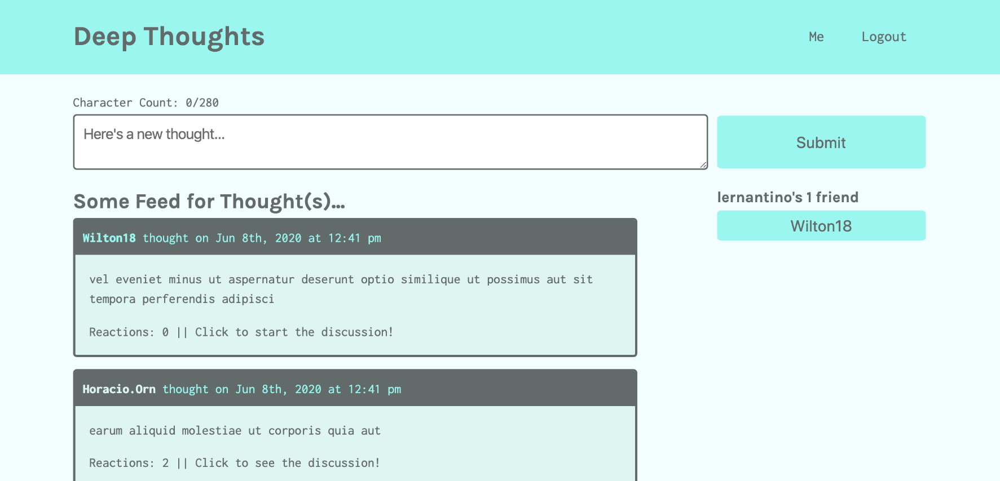

# Deep Thoughts

## Description
Social media application where users can create an account, post their thoughts for others to see, and interact with other users through these thoughts.

## Built With
- MERN Stack
- Mongoose
- GraphQL
- Apollo

## Screenshot

## Installation & Usage
1. Download to local machine
2. Run "npm run install" to install both client and server side dependencies
3. Run "npm run seed" to seed database
4. For development, run "npm run develop" to start both front and back end servers.
5. For production, run "npm start" to start just the front end server.

## Questions
For questions contact Sophia Barrett at sophia@sophiabarrett.co or visit github.com/sophiabarrett.

## License
[GNU General Public License v3.0](./LICENSE)

Copyright © 2022 Sophia Barrett
